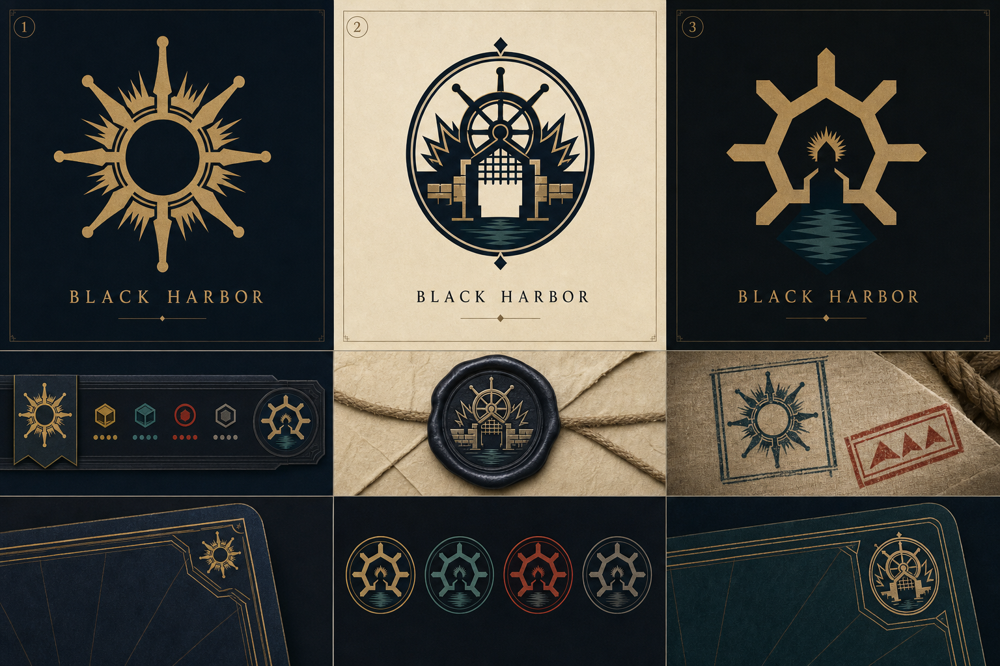
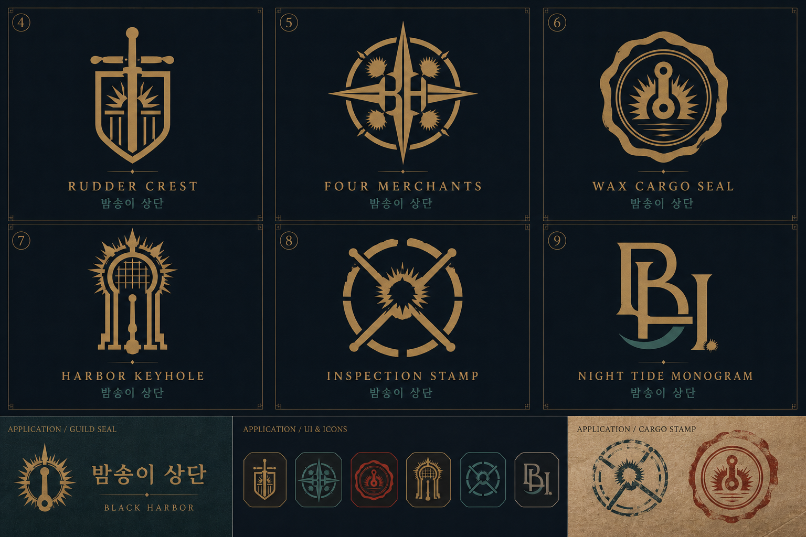
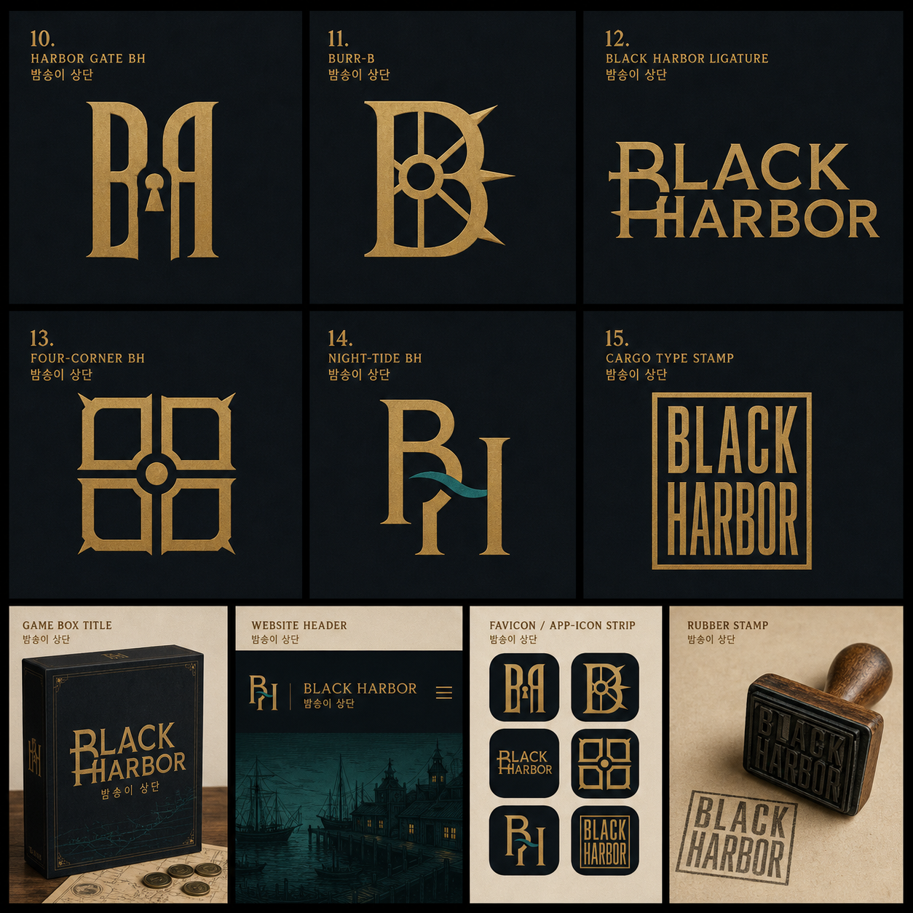

# Black Harbor 로고 방향

## 기본 해석

- `키`: 작은 배 아이콘이 아니라 조타륜(helm)의 원형 구조로 해석
- `밤송이 상단`: 밤송이의 가시를 조타륜의 스포크와 인장 테두리로 변환
- `상단`: 귀여운 캐릭터보다 거래소·화물 봉인·길드 문장처럼 보이는 인장 톤으로 표현
- `Black Harbor`: 밀수와 세관 조사의 긴장감이 있는 어두운 항구의 전략 게임

## 3가지 방향

1. **Burr Helm** — 밤송이 가시와 조타륜을 직접 결합한 기억성 높은 심볼
2. **Merchant Seal** — 조타륜·항구 문·밤송이 인장을 하나의 상단 문장으로 결합한 메인 방향
3. **Black Harbor Key** — 작은 favicon과 게임 UI에 강한 기하학적 아이콘

현재 SVG 기본안은 **2번 Merchant Seal**을 기준으로 만들었다. 둥근 조타륜, 밤송이형 인장, 중앙 항구 문을 하나의 실루엣으로 묶어 프로젝트의 핵심인 “거래를 지휘하고 항구를 통제하는 상단”을 담는다.

## 색상 토큰

| 용도 | 색상 |
| --- | --- |
| 배경/잉크 | `#111921` |
| 상단 인장/골드 | `#C89A3D` |
| 항구 틸 | `#2F7C7A` |
| 종이/문장 내부 | `#F3E8D0` |

경고 상태는 기존 UI의 brick red를 보조색으로 사용하고, 로고 본체에는 남용하지 않는다.

## 파일

- `public/brand/black-harbor-logo.svg` — 텍스트가 깨지지 않는 수동 제작 벡터 기본안
- `docs/branding/black-harbor-logo-directions.png` — 3가지 방향과 적용 예시를 담은 탐색용 보드

## 추가 탐색 4–9

기존 1–3번과 겹치지 않도록 조타 장치, 화물 봉인, 검문 인장, 모노그램을 더 분리해서 탐색했다.

4. **Rudder Crest** — 세로로 선 조타 장치와 방패형 문장을 결합한 길드 문장 방향
5. **Four Merchants** — 네 방향의 조타륜과 네 개의 밤송이 가시로 네 상단의 연합을 표현한 방향
6. **Wax Cargo Seal** — 밀수 화물 봉인처럼 보이는 왁스 인장에 키홀·조타 장치와 밤송이 가시를 넣은 방향
7. **Harbor Keyhole** — 항구 문과 열쇠 구멍을 세로로 단순화한 방향으로 favicon·UI 아이콘에 강함
8. **Inspection Stamp** — 세관 검문 도장과 교차된 조타 장치를 결합한 긴장감 있는 방향
9. **Night Tide Monogram** — `B/H` 모노그램에 밤의 파도와 작은 밤송이 포인트를 넣은 현대적인 방향

이번 추가안에서 우선 검토할 후보는 **6번**이다. “배의 손잡이 키”와 “밤송이 상단”을 하나의 인장으로 묶기 가장 쉽고, 7번은 작은 아이콘용, 4번은 길드 문장용으로 확장하기 좋다.

## 글자 심볼 탐색 10–15

이번에는 별도 그림을 붙이는 대신 `B`와 `H` 자체가 항구 문, 조타 장치, 밤송이 가시가 되도록 레터마크를 탐색했다.

10. **Harbor Gate BH** — `B/H`의 세로 구조를 항구 문처럼 만들고 중앙의 빈 공간에 키홀을 숨긴 심볼
11. **Burr-B** — `B` 안에 조타륜을 넣고 바깥쪽에 밤송이 가시를 더한 단일 이니셜 심볼
12. **Black Harbor Ligature** — `B`와 `H`가 하나의 가로 구조로 연결되는 워드마크
13. **Four-Corner BH** — 네 모서리와 중앙 조타축으로 네 상단의 구조를 표현한 정사각 심볼
14. **Night-Tide BH** — `B/H` 사이를 틸 색 파도가 통과하는 현대적인 모노그램
15. **Cargo Type Stamp** — `BLACK HARBOR`를 화물 봉인처럼 쌓은 압축형 타이포 심볼

글자 심볼 중에서는 **10번**이 메인 로고와 favicon을 동시에 가져가기 가장 좋고, **12번**은 웹 헤더용 워드마크, **15번**은 게임 박스·도장·카드 뒷면에 강하다.
